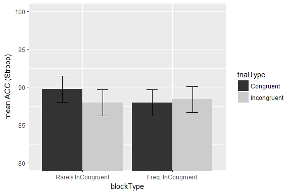
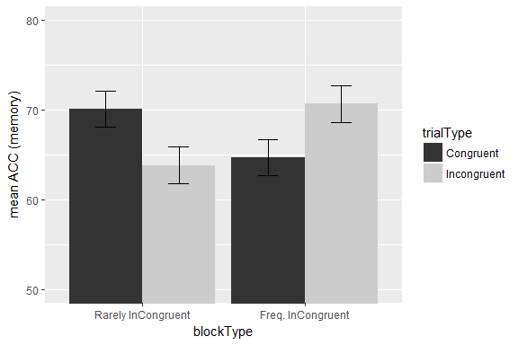

#### First, Set up the environment and load the data: step3\_gpSummary.Rda

#### Set up some formating for the plots

Set up some good format, here i am using apatheme with white background
for figure 1a, with black axis lines, no grids. Default theme is good
for visual comparison (theme\_gray() with white grid lines, gray
background), used for others here.

Stroop Task
-----------

### 1a. Plot the 2 block type x 2 trial type CSPC effect: RT

    levels(CSPC$trialType) <- c("Congruent", "Incongruent")
    levels(CSPC$blockType) <- c("Rarely InCongruent", "Freq. InCongruent")

    CSPC %>%
      ggplot(aes(x = blockType, y = gpmeanRT, fill = trialType))  +
      geom_col(position = dodge) + 
      geom_errorbar(aes(ymax = gpmeanRT + (1*SE_rt), ymin = gpmeanRT - (1*SE_rt)), 
                    position = dodge, width = .25) + 
      apatheme + 
      ylab("mean RT (Stroop)") +
      coord_cartesian(ylim=c(550,700)) +
      scale_fill_grey()

Alternatively, can use geom\_bar(stat='identity', position = dodge) in
lieu of goem\_col(poistion = dodge). The default of geom\_bar is count,
but the default for geom\_col is 'identity' (data)

### 1b. Plot the 2 half x 2 block type x 2 trial type CSPC effect: RT

    levels(CSPC_half$half)      <- c("First Half", "Second Half")
    levels(CSPC_half$blockType) <- c("Rarely InCongruent", "Freq. InCongruent")
    levels(CSPC_half$trialType) <- c("Congruent", "Incongruent")

    CSPC_half %>%
      ggplot(aes(x = blockType, y = gpmeanRT, fill = trialType))  +
      geom_col(position = dodge) + 
      geom_errorbar(aes(ymax = gpmeanRT + (1*SE_rt), ymin = gpmeanRT - (1*SE_rt)), 
                    position = dodge, width = .25) + 
      facet_grid(.~half) + 
      ylab("mean RT (Stroop)") +
      coord_cartesian(ylim = c(550,700)) +
      scale_fill_grey() 

### 2.Plot the 2 block type x 2 trial type CSPC effect: ACC

    CSPC %>%
      ggplot(aes(x = blockType, y = gpmeanACC, fill = trialType))  +
      geom_col(position = dodge) + 
      geom_errorbar(aes(ymax = gpmeanACC + (1*SE_acc), ymin = gpmeanACC - (1*SE_acc)), 
                    position = dodge, width = .25) + 
      ylab("mean ACC (Stroop)") +
      coord_cartesian(ylim=c(65,100)) +
      scale_fill_grey()

### 3a.Plot the 2 block type x 2 trial type ISSP effect: RT

    levels(ISSP$trialType) <- c("Repeat", "Switch")
    levels(ISSP$swProb)    <- c("Rarely switching", "Freq. switching")

    ISSP %>%
      ggplot(aes(x = swProb, y = gpmeanRT, fill = trialType))  +
      geom_col(position = dodge) + 
      geom_errorbar(aes(ymax = gpmeanRT + (1*SE_rt), ymin = gpmeanRT - (1*SE_rt)), 
                    position = dodge, width = .25) + 
      ylab("mean RT (task-switching)") +
      coord_cartesian(ylim=c(550,700)) +
      scale_fill_grey()

### 3b.Plot the 2 half x 2 block type x 2 trial type ISSP effect: RT

    levels(ISSP_half$trialType) <- c("Repeat", "Switch")
    levels(ISSP_half$swProb) <- c("Rarely switching", "Freq. switching")
    levels(ISSP_half$half) <- c("First half", "Second half")

    ISSP_half %>%
      ggplot(aes(x = swProb, y = gpmeanRT, fill = trialType))  +
      geom_col(position = dodge) + 
      geom_errorbar(aes(ymax = gpmeanRT + (1*SE_rt), ymin = gpmeanRT - (1*SE_rt)), 
                    position = dodge, width = .25) + 
      facet_grid(.~half) + 
      ylab("mean RT (task-switching)") +
      coord_cartesian(ylim=c(550,700)) +
      scale_fill_grey()

### 4.Plot the 2 block type x 2 trial type ISSP effect: ACC

    ISSP %>%
      ggplot(aes(x = swProb, y = gpmeanACC, fill = trialType))  +
      geom_col(position = dodge) + 
      geom_errorbar(aes(ymax = gpmeanACC + (1*SE_acc), ymin = gpmeanACC - (1*SE_acc)), 
                    position = dodge, width = .25) + 
      ylab("mean ACC (task-switching)") +
      coord_cartesian(ylim=c(65,100)) +
      scale_fill_grey()

Memory Recognition Task
-----------------------

### 5a.Plot the memory performance as a function of control context previously (2 block type x 2 trial type) in the Stroop task

    levels(recogM$trialType) <- c("Congruent", "Incongruent","New")
    levels(recogM$blockType) <- c("Rarely InCongruent", "Freq. InCongruent", "New")

    recogM %>%
      ggplot(aes(x = blockType, y = gpmeanACC, fill = trialType))  +
      geom_col(position = dodge) + 
      geom_errorbar(aes(ymax = gpmeanACC + (1*SE_acc), ymin = gpmeanACC - (1*SE_acc)), 
                    position = dodge, width = .25) + 
      ylab("mean ACC (memory)") +
      coord_cartesian(ylim=c(45,80)) +
      scale_fill_grey()

 \#\#\# 5b.Plot the memory performance as a
function of control context previously (2 half x 2 block type x 2 trial
type) in the Stroop task

    levels(recogM_half$trialType) <- c("Congruent", "Incongruent", "New")
    levels(recogM_half$blockType) <- c("Rarely InCongruent", "Freq. InCongruent", "New")
    levels(recogM_half$half)      <- c("New", "First Half", "Second Half")

    recogM_half %>%
      ggplot(aes(x = blockType, y = gpmeanACC, fill = trialType))  +
      geom_col(position = dodge) + 
      geom_errorbar(aes(ymax = gpmeanACC + (1*SE_acc), ymin = gpmeanACC - (1*SE_acc)), 
                    position = dodge, width = .25) + 
      facet_grid(.~half) + 
      ylab("mean ACC (memory)") +
      coord_cartesian(ylim=c(45,80)) +
      scale_fill_grey()

### 6.Plot the RT for memory task as a function of control context previously (2 block type x 2 trial type) in the Stroop task

    recogM %>%
      ggplot(aes(x = blockType, y = gpmeanRT, fill = trialType))  +
      geom_col(position = dodge) + 
      geom_errorbar(aes(ymax = gpmeanRT + (1*SE_rt), ymin = gpmeanRT - (1*SE_rt)), 
                    position = dodge, width = .25) + 
      ylab("mean RT (memory)") +
      coord_cartesian(ylim=c(800,1000)) +
      scale_fill_grey()

### 7.Scatter plot (CSPC vs. ISSP) to see if there is any relationship bw two effects:

    gpBasic %>%
      ggplot(mapping = aes(x = ISSP, y = CSPC)) + 
      geom_point() + 
      geom_smooth(method=lm)

No correlation so far, p =

    cor(gpBasic$CSPC, gpBasic$ISSP)

    ## [1] -0.2539264
